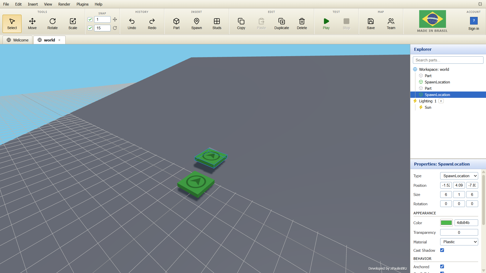
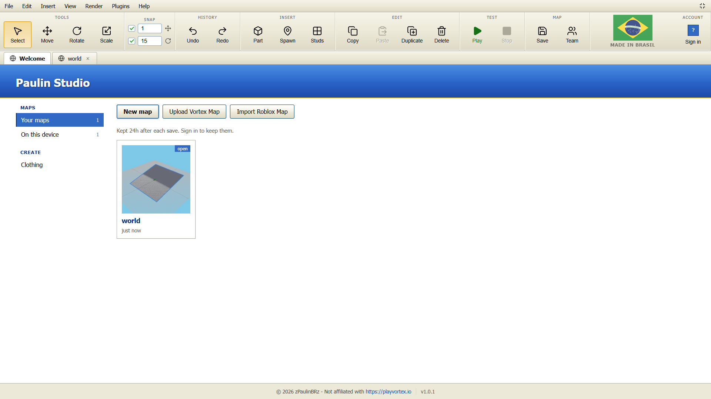
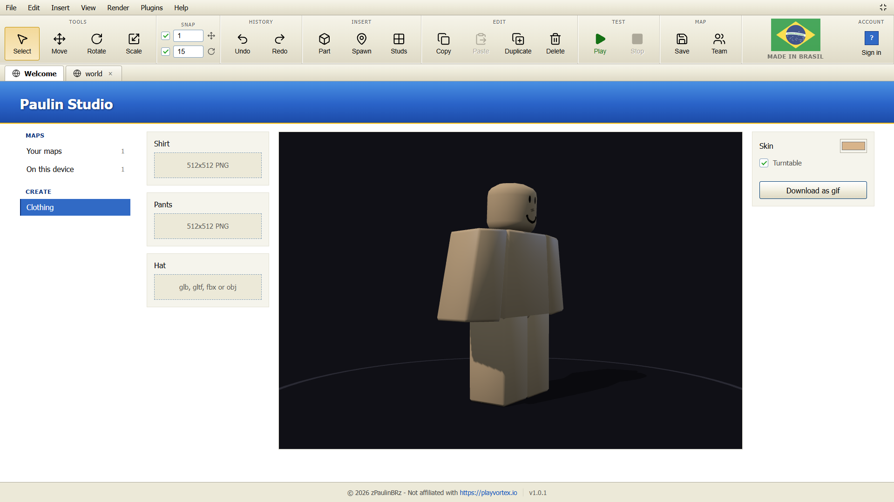
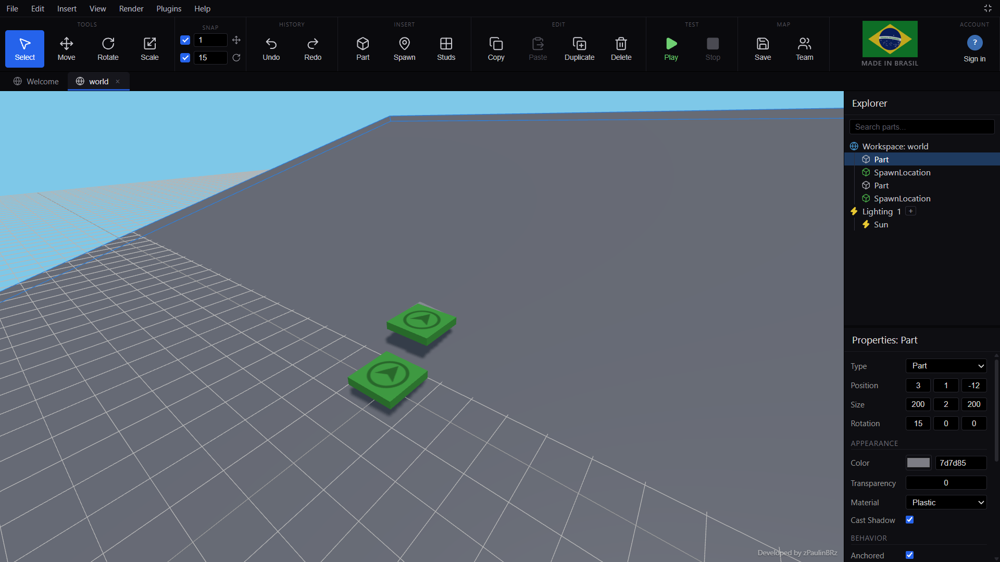
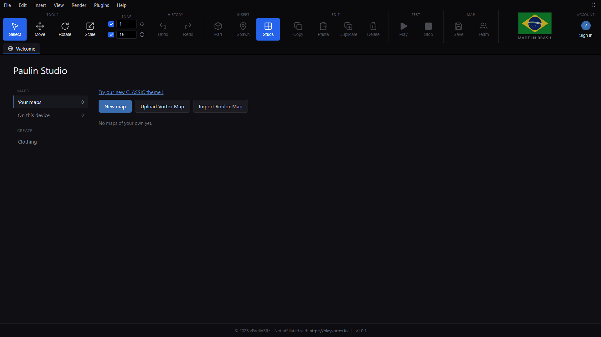

# Vortex Studio

Vortex Studio is an open source, web based 3D studio, game creator, and real time collaborative building environment built with Laravel, React, Three.js, Rapier3D, and WASM Lua.

It enables users to construct 3D environments, script game behavior in Lua, test play with rigid body physics, customize avatars, work together live in shared rooms, and manage project versions directly in the browser.

## Screenshots

### Classic Theme Editor


### Classic Theme Start Screen


### Classic Theme Clothing Customizer


### Modern Dark Theme Editor


### Modern Dark Theme Start Screen


## Core Features

### 3D Viewport and Geometry Editor
* WebGL Rendering: Powered by Three.js with shadows, directional sunlight, and smooth camera controls.
* Interactive Gizmos: Visual handles for selecting, translating, rotating, and scaling 3D parts.
* Primitive Shapes: Support for Block, Sphere, Cylinder, Wedge, and SpawnLocation objects.
* Material System: Materials including Plastic, Wood, Metal, Grass, Ice, and Paint with PBR texture maps.
* Surface Textures: Studs and Inlets options configurable per part face.
* Color and Appearance: Color picker supporting hex values, transparency, and cast shadow settings.
* Alignment Tools: Snap objects along X, Y, and Z axes, align bounding boxes, or match part edges.
* Map Shift: Move Map tool for translating entire 3D scenes at once.
* Scene Hierarchy Explorer: Folder grouping, parent-child object tree, renaming, and visibility toggles.
* Properties Inspector: Edit position, size, rotation, anchors, collisions, and visual properties.

### Physics and In-Browser Playtesting
* WebAssembly Physics: Integrated Rapier3D engine for fast, accurate 3D rigid body dynamics.
* Player Avatar Controller: Built-in 3D player avatar supporting walking, jumping, yaw rotation, and shift lock mode.
* Dynamic Unanchored Parts: Unanchored blocks fall, tumble, slide, and can be stood on during play tests.
* Spatial 3D Audio: Sound effects for footstep movement, jumping, falling, and landing.
* Mobile Support: On-screen touch controls for playtesting on mobile devices.

### Embedded Lua Scripting and Plugin Engine
* Code Editor: Integrated CodeMirror 6 text editor with Lua syntax highlighting, line numbers, and autocompletion.
* Wasmoon Runtime: Embedded Lua 5.4 engine running in WebAssembly.
* Built-in Procedural Plugins:
  * Archimedes: Generates smooth curved part structures.
  * Circle: Arranges parts in radial circular layouts.
  * Gapfill: Automatically bridges gaps between part faces.
  * Mirror: Duplicates and mirrors object selections across axes.
  * Terrain and Voxel: Generates heightmaps and voxel terrain blocks.
  * Stairs: Constructs custom step staircases.
  * Scatter: Randomly distributes parts across surfaces.
  * Paintbrush: Applies materials and colors across multiple parts.
  * Imagemaker: Maps 2D images onto 3D part voxel grids.

### Real-Time Collaborative Editing
* WebSocket Server: Standalone Node.js live editing server handling multi-user room sessions.
* Conflict-Free State Sync: Shared operational transform engine (ops.js) ensuring idempotent edit ordering.
* Multiplayer Avatars: See teammates running around in real time during live team playtests.
* Live Presence Tracking: View team member camera positions and active object selection outlines.
* Role-Based Access Control: Owner, Developer, and Spectator roles with server side permission enforcement.
* Session Security: HMAC SHA256 live tokens issued by the Laravel backend for verified identity.

### Character and Clothing Customizer
* Avatar Creation: Custom 3D character preview with adjustable skin tones and rotation turntable.
* Texture Layering: Upload and apply custom 512x512 PNG templates for shirts and pants.
* Accessory Models: Attach 3D hat assets in GLB, GLTF, FBX, or OBJ formats.
* GIF Export: Export animated avatar turntable previews directly to GIF files.

### Project Management and Versioning
* Authentication: Support for guest access, user registration, login, and profile settings.
* Team Workspaces: Create teams, invite members, assign roles, and share team maps.
* Version History: Pin version snapshots, inspect past revisions, and restore older map states.
* Soft Delete Recovery: Trash bin storing deleted maps for 30 days before permanent purging.
* Map Thumbnails: Automatic WebP thumbnail generation and caching for project listings.

### Themes and Administration
* Dual Interface Themes: Switch anytime between the classic light theme and the modern dark theme.
* Administrative Dashboard: Overview metrics, user management, map moderation, audit logging with thumbnail snapshots, and system usage analytics.

## Framework Foundation and Learning

### About Laravel
Vortex Studio is built on top of Laravel, a PHP web application framework providing:
* Fast routing engine
* Dependency injection container
* Session and cache storage backends
* Database ORM (Eloquent)
* Schema migrations
* Background job processing
* Real time event broadcasting

### Learning Laravel
To learn more about the underlying Laravel framework:
* [Laravel Documentation](https://laravel.com/docs)
* [Laracasts Video Tutorials](https://laracasts.com)
* [Laravel Learn](https://laravel.com/learn)

### Agentic Development
Laravel provides a predictable structure for AI coding agents. You can install Laravel Boost:

```bash
composer require laravel/boost --dev
php artisan boost:install
```

## Prerequisites

* PHP 8.3 or newer
* Composer
* Node.js 20 or newer

## Quickstart

### 1. Installation

Clone the repository and install dependencies:

```bash
git clone https://github.com/ShahbazCoder1/vortex-studio.git
cd vortex-studio
composer install
npm install
cp .env.example .env
php artisan key:generate
```

### 2. Database Migration

Run database migrations:

```bash
php artisan migrate
```

### 3. Run the Development Server

Start the PHP backend server and Vite frontend compiler in separate terminals:

```bash
# Terminal 1: Backend
php artisan serve

# Terminal 2: Frontend assets
npm run dev
```

Alternatively, run all services concurrently using:

```bash
composer run dev
```

Open your browser at `http://localhost:8000`.

### 4. Optional: Run the Live Editing Server

To enable real-time multiplayer editing, start the WebSocket server:

```bash
cd live-editing-server
npm install
cp .env.example .env
npm start
```

Update your studio `.env` file to point to the live editing socket:

```env
VITE_LIVE_URL=ws://localhost:8787
LIVE_SECRET=your_shared_secret_key
```

Make sure `LIVE_SECRET` matches in both the main `.env` and `live-editing-server/.env`.

## Development and Testing

Before opening a pull request, ensure all tests pass:

```bash
# Run JavaScript unit tests
npm test

# Build production bundle
npm run build

# Run Lua plugin linter
node luacheck.mjs

# Run PHP unit and feature tests
./vendor/bin/pest

# Run Live Editing Server test suite
cd live-editing-server && npm test
```

## System Architecture

* Backend: Laravel 13 framework on PHP 8.3 handling database storage, user auth, team access rules, map versioning, and HMAC token signing.
* Frontend: React 19 single page application rendering 3D graphics via Three.js, executing physics with Rapier3D, and evaluating Lua scripts via Wasmoon.
* Live Editing Microservice: Standalone Node.js WebSocket process maintaining room state in memory and broadcasting operational edits.

## Contributing and Community

### Contributing
Contributions are welcome. Please read [CONTRIBUTING.md](CONTRIBUTING.md) for branch naming conventions, code style, commit standards, and pull request requirements.

### Code of Conduct
Please review the [Laravel Code of Conduct](https://laravel.com/docs/contributions#code-of-conduct) to ensure a welcoming community environment.

### Security Vulnerabilities
If you discover a security vulnerability within the framework or application, please send an email to Taylor Otwell via taylor@laravel.com. All security vulnerabilities will be promptly addressed.

## Contributors

* 0rndm_p
* Arbuz
* Paulo Junior

## License

This project is licensed under the AGPL-3.0-or-later license.
