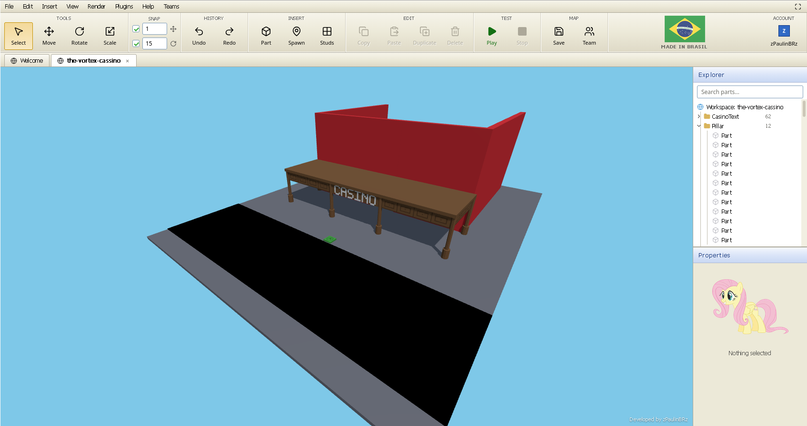

# Vortex Studio

A web-based 3D map editor built with Laravel, React, Three.js and Rapier3D. It runs entirely in the browser, supports real-time collaborative editing, and lets you test your maps with a playable character without leaving the editor.

A live instance is available at [studio.zpaulin.com](https://studio.zpaulin.com).

> This map editor is not affiliated with or endorsed by [Vortex](https://playvortex.io). The map format is compatible though, so anything built here can be exported and used in Vortex's official studio.



## Features

### 3D Viewport and Geometry Editor

The editor runs on Three.js with a WebGL viewport that has shadows, a directional sun, and orbit and fly camera modes. You can insert parts (Block and SpawnLocation), then move, rotate and scale them using on-screen gizmos or by typing values straight into the Properties panel. Materials are Plastic, Wood, Metal, Grass, Ice and Paint, all with PBR texture maps. Each face can have Studs or Inlets applied on its own. The Explorer panel on the right shows the full scene tree and supports folder grouping and renaming.

Map Transfer lets you move a map between your personal storage and a team workspace without losing any of its history.

### Playtesting

Hit Play and a character spawns in the map. You can walk, jump and look around. Unanchored parts fall and behave physically using Rapier3D in WebAssembly, so you can stack blocks, shove things around, and stand on top of moving objects. Footsteps, jumps and falls all have matching sound effects.

On mobile, on-screen touch controls replace the keyboard and mouse so you can play and build on a phone or tablet with no extra setup. Mobile is a first-class feature, not an afterthought - the controls were designed for it from the start.

### Plugins

Plugins are Lua scripts that run inside a Wasmoon (Lua 5.4 in WebAssembly) sandbox and generate parts procedurally. You can write or edit them in a built-in CodeMirror 6 editor with syntax highlighting and autocompletion. There are quite a few built-in ones that cover the most common use cases:

* Archimedes: builds curved part arcs.
* Array: duplicates a selection into a configurable grid.
* Circle: places parts in circular layouts.
* Gapfill: fills gaps between part faces.
* Mirror: mirrors a selection across an axis.
* Terrain: generates a heightmap landscape.
* Voxel: reconstructs a 3D model using only part positions, giving the result a distinct voxel look without rotations.
* Stairs: builds staircase structures.
* Scatter: distributes parts randomly across a surface.
* Paintbrush: paints materials and colors across multiple parts.
* Imagemaker: turns a 2D image into a flat voxel grid.
* Model: places parts from imported model data.
* Text: generates text as parts.

### Live Collaboration

Multiple people can edit the same map at the same time. A standalone Node.js WebSocket server keeps everyone in sync using a shared operational transform engine, so edits always land in the same order regardless of who sends them. You can see where teammates are looking, what they have selected, and watch them run around during a playtest. Roles (Owner, Developer, Spectator) are enforced server-side - the server refuses ops from spectators rather than trusting the client to grey out its own buttons. Signed-in users get a short-lived HMAC token from Laravel so the live server knows who they are without hitting the database.

### AI Map Building (MCP)

A local MCP server in `mcp-server/` lets Claude Code build and refine maps. It works in terms of level design rather than individual parts - create a room with doorways, connect two rooms with a corridor that cuts its own openings through the walls, scatter props over an area, generate terrain - and it can render the map to an image and look at its own work, then check playability against the real character constants before calling it finished. It signs in as your Studio account and joins a live session as `Your Name (MCP)`, so you watch it build in the browser as it goes. See [mcp-server/README.md](mcp-server/README.md).

### Character and Clothing Customizer

The clothing section lets you upload a 512x512 PNG for a shirt and pants, attach a 3D hat in GLB, GLTF, FBX, or OBJ format, pick a skin tone, and preview the result on a rotating character. You can download the preview as an animated GIF.

### Project Management

Maps are saved server-side and shown on the start screen with WebP thumbnails. Guest maps stick around for 24 hours, and signing in keeps them for good. You can pin version snapshots and roll back if something breaks. Deleted maps sit in a trash bin for 30 days before they get wiped. Teams work how you would expect - create one, invite people, set their role, and the shared maps show up for everyone.

### Administration

Admins have a dashboard that shows usage metrics, lets them manage user accounts, review maps, and inspect an audit log that includes image snapshots of map saves.

## Framework Foundation and Learning

Vortex Studio is built on top of Laravel, a PHP framework with a fast routing engine, dependency injection, Eloquent ORM, database migrations, background queues and real-time event broadcasting.

To learn more about Laravel:
* [Laravel Documentation](https://laravel.com/docs)
* [Laracasts Video Tutorials](https://laracasts.com)
* [Laravel Learn](https://laravel.com/learn)

### Agentic Development

Laravel's predictable conventions work well with AI coding agents. Install [Laravel Boost](https://laravel.com/docs/ai) to get 15+ tools and skills built for building Laravel apps:

```bash
composer require laravel/boost --dev
php artisan boost:install
```

## Prerequisites

* PHP 8.3 or newer
* Composer
* Node.js 20 or newer

## Quickstart

### 1. Installation

```bash
git clone https://github.com/N7z/vortex-studio.git
cd vortex-studio
composer install
npm install
cp .env.example .env
php artisan key:generate
```

### 2. Database Migration

```bash
php artisan migrate
```

### 3. Run the Development Server

```bash
php artisan dev
```

This starts the backend, frontend asset compiler, scheduler, queue worker and, once its dependencies are installed, the live editing server. `composer run dev` does the same thing. Run `php artisan dev:list` to see the processes. Open your browser at `http://localhost:8000`.

### 4. Optional: Live Editing Server

To enable real-time multiplayer editing, install its dependencies once:

```bash
cd live-editing-server
npm install
cp .env.example .env
```

From then on `php artisan dev` starts it along with everything else, as the `live` process. Until
those dependencies exist it is skipped, so the dev stack still comes up without it. To run it on its
own instead, use `npm start` from that directory.

Then add these to your studio `.env`:

```env
VITE_LIVE_URL=ws://localhost:8787
LIVE_SECRET=your_shared_secret_key
```

`LIVE_SECRET` must match in both `.env` files. Without it the server still works, but identity is not verified and members keep randomly generated names.

### 5. Optional: MCP Server for AI Map Building

To let Claude Code build maps in the editor:

```bash
cd mcp-server
npm install
cp .env.example .env
claude mcp add vortex-studio -- node "$(pwd)/src/index.js"
```

Put your Studio email and password in `mcp-server/.env` so the agent can sign in as you. It needs no
port of its own - Claude Code runs it as a local subprocess. Live editing needs `LIVE_SECRET` set,
as above. See [mcp-server/README.md](mcp-server/README.md).

## Development and Testing

Before opening a pull request, run everything CI runs:

```bash
npm test
npm run build
node luacheck.mjs
./vendor/bin/pest
cd live-editing-server && npm test
cd ../mcp-server && npm test
```

All of it has to pass. See [CONTRIBUTING.md](CONTRIBUTING.md) for branch naming, commit style, and pull request guidelines.

## System Architecture

The Laravel backend handles persistence, authentication, team permissions, version snapshots, and HMAC token signing. The React frontend renders the 3D scene with Three.js, runs physics with Rapier3D, and executes Lua plugins through Wasmoon. The live editing server is a standalone Node.js process that keeps room state in memory and syncs edits between clients over WebSocket. The MCP server is a separate stdio process that speaks the same op protocol as a client, so AI editing goes through exactly the same validation and role checks as a browser.

## Contributing and Community

Contributions are welcome. Read [CONTRIBUTING.md](CONTRIBUTING.md) before opening a pull request.

### Code of Conduct

Please review the [Laravel Code of Conduct](https://laravel.com/docs/contributions#code-of-conduct) to keep the community welcoming.

### Security Vulnerabilities

If you find a security vulnerability in the application, open a private issue or contact the maintainer directly. If the vulnerability is in the Laravel framework itself, report it to Taylor Otwell at taylor@laravel.com.

## Contributors

* [@N7z](https://github.com/N7z)
* [@kindtracker](https://github.com/kindtracker)
* [@Arbuzyonak](https://github.com/Arbuzyonak)

## License

This project is open-source software licensed under the [GNU Affero General Public License Version 3 (AGPL-3.0-or-later)](LICENSE).
